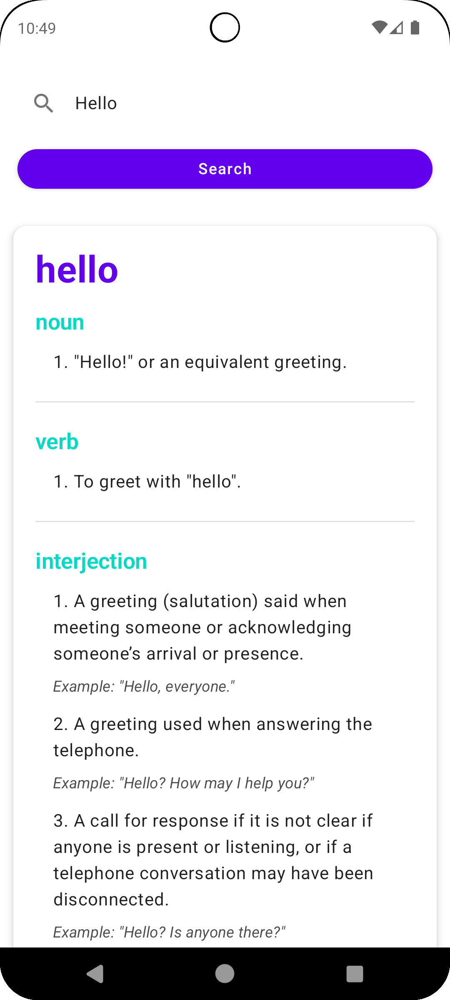
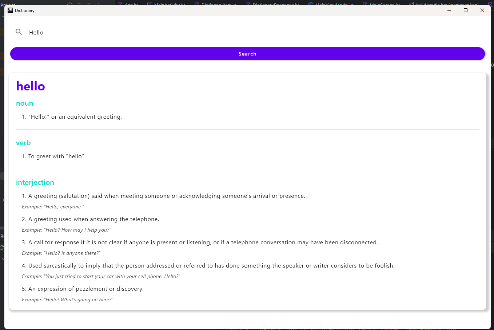

# Dictionary-KMP

Dictionary-KMP is a Kotlin Multiplatform (KMP) project that provides word definitions by integrating with a dictionary API. It uses **Ktor Server** for handling requests, **Koin** for dependency injection, and **Ktor Client** for fetching word meanings from an external API. The project is designed to work across platforms including Android and Desktop.

## Features

- **KMP Architecture**: Share business logic across platforms.
- **Koin**: Manage dependencies.
- **Ktor Client**: Fetch word meanings from the external API.
- **Navigation Component**: Easily navigate between screens in the Android app.

## Prerequisites

- [Kotlin](https://kotlinlang.org/) installed on your machine.
- [Gradle](https://gradle.org/install/) for building and running the project.

## Getting Started

### Clone the Repository

```bash
git clone https://github.com/aiyu-ayaan/Dictionary-KMP.git
cd Dictionary-KMP
```

### Compile and Run for Desktop

To compile and run the project on the desktop, use the following command:

```bash
./gradlew run
```

This will start the desktop application, where you can search for word definitions.

### Running the Android Application

1. Open the project in Android Studio.
2. Connect an Android device or use an emulator.
3. Build and run the project via Android Studio.

### Ktor Server

This project depends on a **Ktor Server** for fetching word definitions. Make sure to run the Ktor server available at [Dictionary-KMP Ktor Server GitHub](https://github.com/aiyu-ayaan/Dictionary-Ktor-Server) before running the client applications to ensure proper responses from the API.

## Screenshots

### Android App



### Desktop App




## License

This project is licensed under the MIT License. See the [LICENSE](./LICENSE) file for details.

## GitHub

[Dictionary KMP GitHub Repo](https://github.com/aiyu-ayaan/Dictionary-Ktor-Server.git)

### Key Changes:

1. **Ktor Server**: Mentioned that the server is in a separate repo and added the link for it.
2. **Run the Ktor Server**: Added a note to ensure the server is running for proper API responses.
